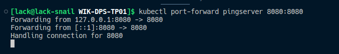
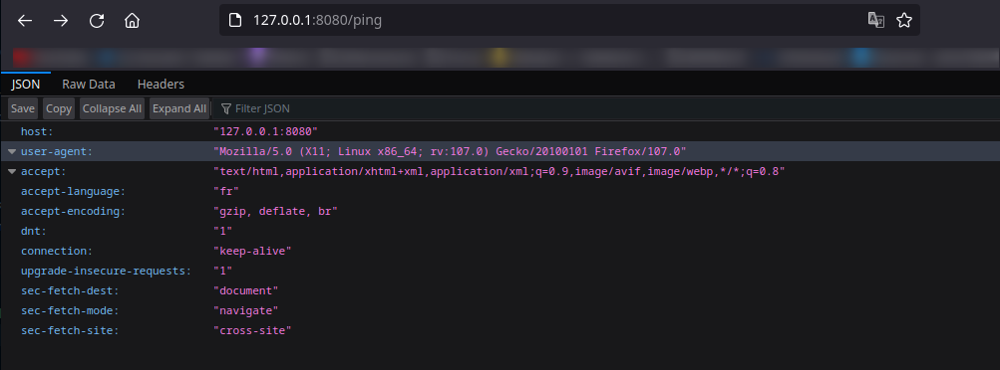
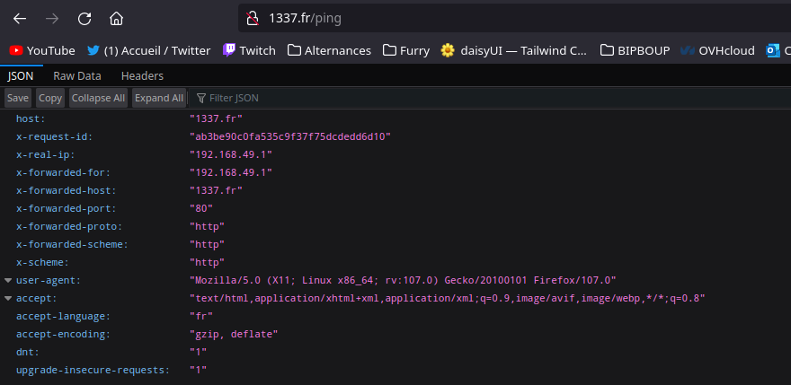
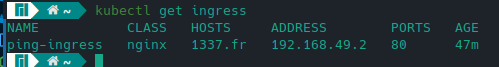

# TP 01 - DevOps - WIK-DPS-TP01

## Projets

API en TypeScript avec Express.js : [API EXPRESS](./typescript)
API en Rust : [API RUST](./rust)

## Objectifs

- Creér une petite API en TypeScript et en Rust.

## Contneurisation et Orchestration

### Kubernetes

- **Mise en place d'un pod avec port forwarding**



- **Remplacement du Pod par un ReplicaSet avec 4 replicas**

Présence des répliques :

```sh
~ kubectl get pods
NAME               READY   STATUS    RESTARTS   AGE
pingserver-74jh8   1/1     Running   0          3m9s
pingserver-8pp4x   1/1     Running   0          3m9s
pingserver-bkf44   1/1     Running   0          3m9s
pingserver-qh8tv   1/1     Running   0          3m9s
```

ReplicaSet :

```sh
~ kubectl get replicaset
NAME         DESIRED   CURRENT   READY   AGE
pingserver   4         4         4       8m13s
```

Service pour le port-forwarding :

```bash
~ kubectl get service 
NAME           TYPE        CLUSTER-IP     EXTERNAL-IP   PORT(S)    AGE
kubernetes     ClusterIP   10.96.0.1      <none>        443/TCP    20m
ping-service   ClusterIP   10.101.82.77   <none>        8080/TCP   39s

-----

~ kubectl port-forward service/ping-service 8080:8080
Forwarding from 127.0.0.1:8080 -> 8080
Forwarding from [::1]:8080 -> 8080
Handling connection for 8080
```

- **Mise en place d'un `Deployement` avec une stratégie d'update**

Déploiment en cours :

```sh
~ kubectl get deploy 
NAME         READY   UP-TO-DATE   AVAILABLE   AGE
pingserver   2/4     4            2           58s
```

Déploiment terminé :

```sh
~ kubectl get deploy 
NAME         READY   UP-TO-DATE   AVAILABLE   AGE
pingserver   4/4     4            4           110s

---

~ kubectl get pods 
NAME                          READY   STATUS    RESTARTS   AGE
pingserver-846db87759-nj7j8   1/1     Running   0          2m29s
pingserver-846db87759-qlh8q   1/1     Running   0          2m29s
pingserver-846db87759-vgbjw   1/1     Running   0          2m29s
pingserver-846db87759-w2rzd   1/1     Running   0          2m29s
```

> Avec le port forwarding en utilisant le service



- **Utilisation d'Ingress**

> On ajoute ingress dans la config de kubernetes

```yaml
apiVersion: networking.k8s.io/v1
kind: Ingress
metadata:
  name: ping-ingress
  annotations:
    nginx.ingress.kubernetes.io/rewrite-target: /
spec:
  ingressClassName: nginx
  rules:
  - host: 1337.fr
  - http:
      paths:
      - path: /
        pathType: Prefix
        backend:
          service:
            name: ping-service
            port:
              number: 8080
```

> On ajoute le host dans le fichier hosts

```sh
~ sudo nano /etc/hosts

192.168.49.2 1337.fr
```

- **Test de l'ingress**





## Crédits

- [Valentin DAUTREMENT](https://github.com/valentin-dlack/)
