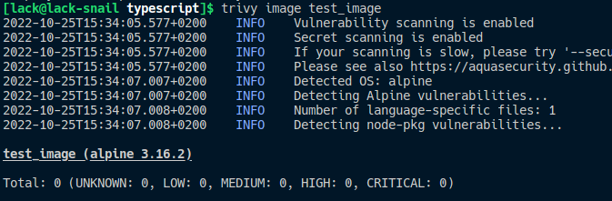

# API EN TypeScript AVEC EXPRESS.JS et Docker

## Utilisation

```bash
> npm install
> npm run start
```

> Le script `npm run start` build le projet et lance le serveur.

Le serveur est lancé sur le port 3000 par défaut, mais il est possible de le changer en passant une variable d'environnement `PING_LISTEN_PORT`.

Pour simplement build le projet, il suffit de lancer la commande `npm run build`.

## Docker

Il y a deux dockerfile disponibles :

- `Dockerfile-1` : Image basée sur alpine sans multi-stage build
- `Dockerfile-2` : Image basée sur node:alpine **avec** multi-stage build

> Pour les utiliser, il suffit de renommer le dockerfile désiré en `Dockerfile` et de lancer la commande `docker build -t <name> .`

## Scan de vulnérabilité



## Tests

Il est possible de tester l'erreur 500 en décommentant la ligne 19 à 24 du fichier `src/index.ts`.

```ts
app.get("/ping", (req: Request, res: Response, next: Function) => {
  res.json(req.headers);
  //uncomment to test the error handling :
    /*try {
        TestError(false);
    } catch (e) {
        next(e);
    }*/
});
```
